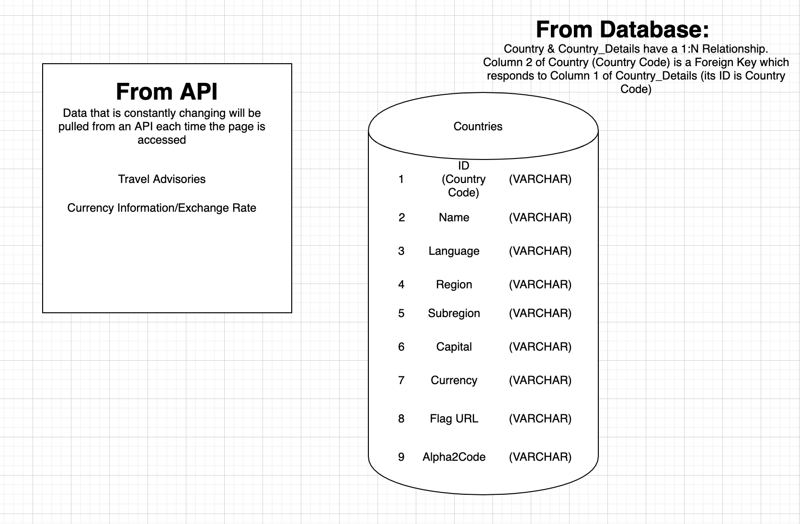
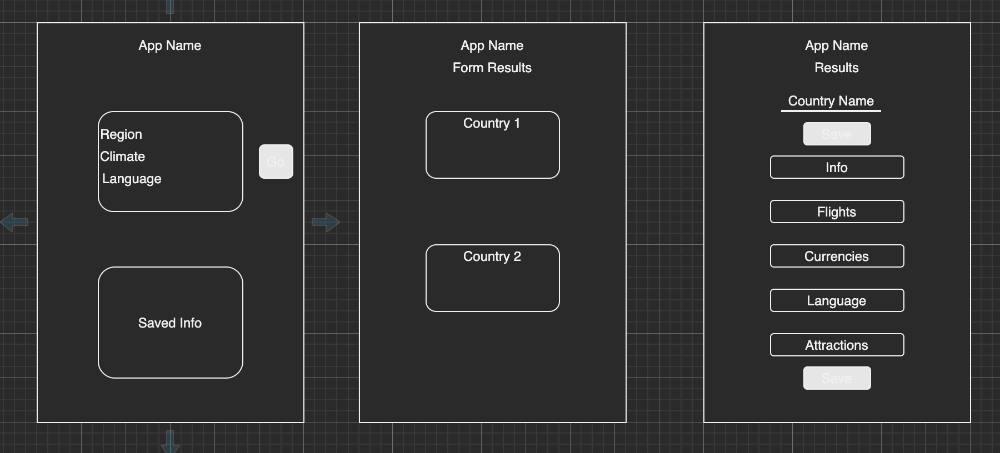
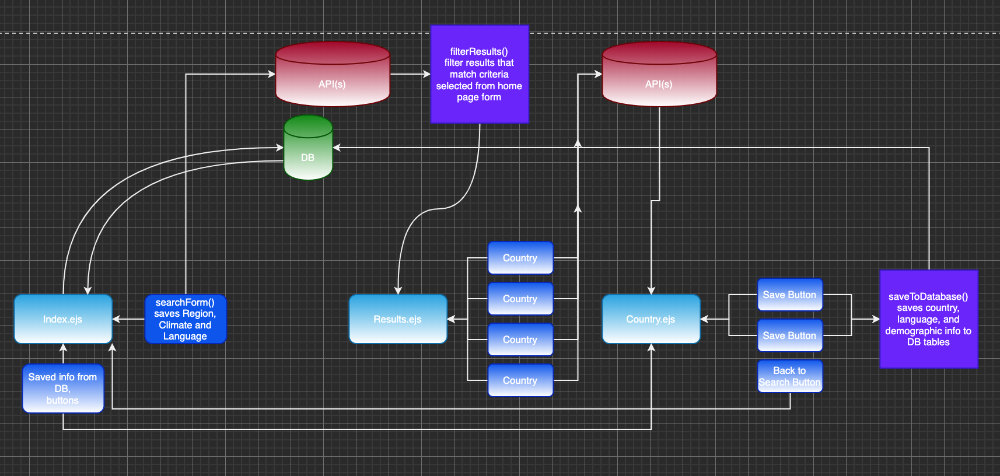

# xPatriate

**Contributors**: Sue Duclos, Clayton Jones, Cas Olejniczak, Eyob Tamir
**Version**: 1.0.0

## Deployed Site
[xPatriate via Heroku](https://xpatriate.herokuapp.com/)

## Problem Domain
This application aims to aid the user in research as they consider moving to another country. Researching potential locations for an international move can be daunting and disorganized, but this application provides a centralized location for all of the user's initial searches! Rather than having several browser tabs open, looking at information for countries all over the world, the user can simply utilize with one interface. The use of SQL database for storing information helps by holding a user's chosen countries so that they can be easily compared.

## Overview
This Application allows the user to search for a new country to move to! 
* Users can search for a specific country by name, or they can narrow down their options for relocation by region, subregion, and official national language.
* Data returned includes basic country information such as national language, capital city, currency and exchange rates, and travel advisory information.
* Users can save countries to a list for later viewing, and they can also remove countries they are no longer considering from their list.

## Getting Started (for Devs)
1.  fork the repository
2.  clone it down locally
3.  run `npm i` in terminal from inside repo to install dependencies

## Project Management
View our work flow and user stories [here](https://trello.com/b/tkq8DAxK/get-outta-here).

## Dependencies Required
* cors
* dotenv
* ejs
* express
* pg
* superagent

## Architecture
### Database Relationships

### Wireframes

### Data Flow

## Change Log
<!-- -->

## Credits and Collaborations
[About Us Hover Overlay](https://www.w3schools.com/howto/tryit.asp?filename=tryhow_css_image_overlay_fade)

## Resources
[Rest Countries API](https://restcountries.eu/)
[Currency Exchange API](https://www.exchangerate-api.com/)
[Travel Advisory API](https://rapidapi.com/nh2000/api/travel-advisory)
[Visa Information Website](https://visadb.io/)
